# 1. 데이터베이스

### 1) ERD

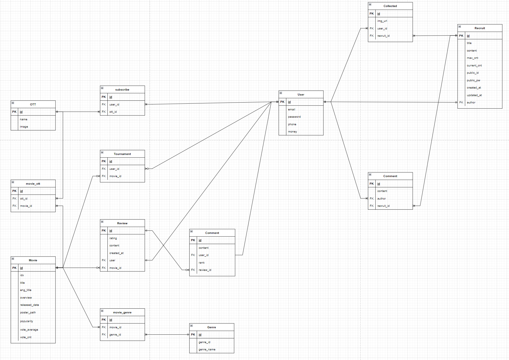

### 2) 데이터

- TMDB에서 영화데이터를 가져옴

- 각 OTT 서비스에서 어떤 영화들이 있는지 데이터베이스화

  - TMDB 사이트에선 각 OTT 서비스에 어떤 영화들이 있는지 제공해주지만, API로 제공해주진 않음

    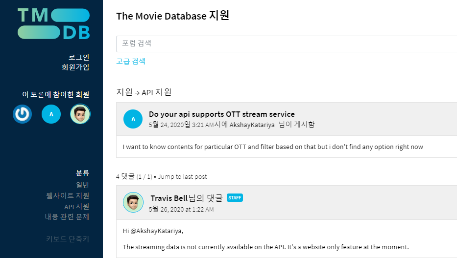

  - Kaggle 에서 OTT 서비스와 영화에 대한 정보가 있어서 활용

    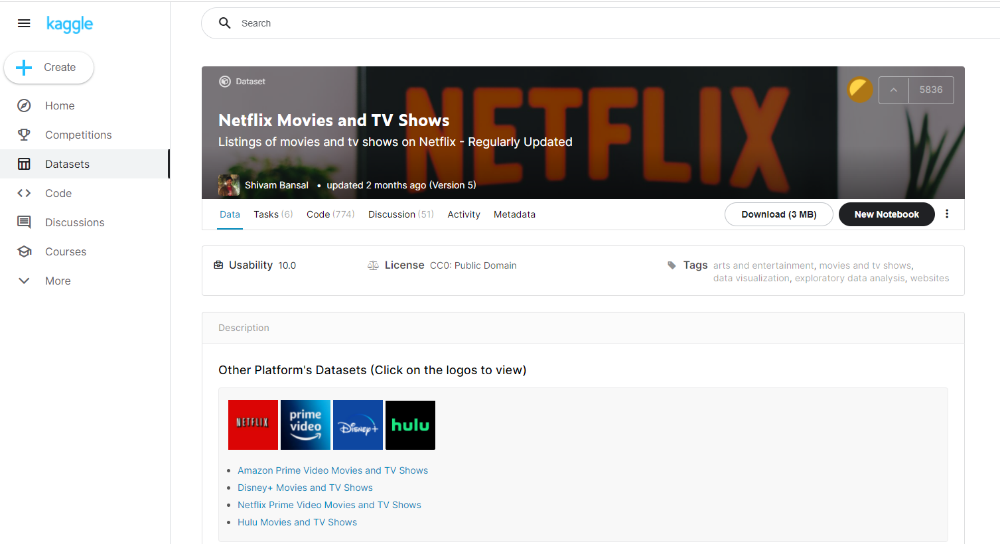

# 2. 메인 페이지

### 1) 각 OTT 서비스별 인기 영화  및 내 MVTI 영화

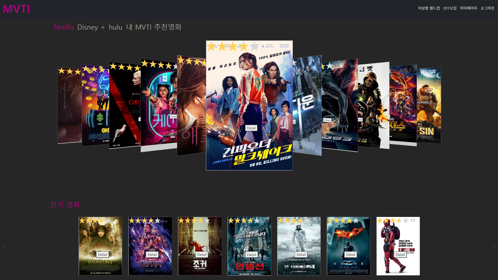

##### (1) UI 설계의도

- 프로젝트에서 가장 강조하고 싶은 2가지 특징과 관련된 콘텐츠 요소이기 때문에 3D 이미지 슬라이드를 사용
  - 각 OTT 서비스에서 제공하는 인기 영화
  - 사용자 영화 취향 분석(이상형 월드컵)을 통한 추천 영화
- 메인화면의 최상단에 가장 많은 영역을 차지

##### (2) 기능 설명 및 구현 방법

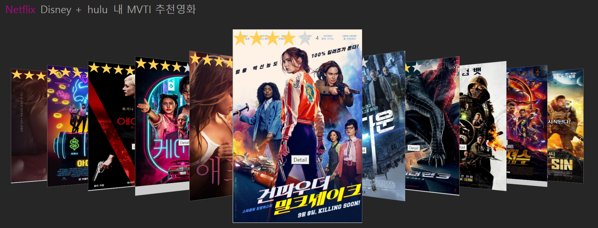

- Netflix, Disney+, hulu, MVTI 추천영화 링크를 누르면 각각에 맞는 영화 정보들이 보여짐

  - 선택한 링크에 해당하는 영화 정보는 selected_movies를 통해서 보여줌
    - 각 링크에 클릭 이벤트가 발생할 경우, selected_movies를 해당 요소로 바꾸어줌
  - 링크 색 바꾸기
    - 현재 사용자가 보고 있는 영화들이 어떤 항목과 관련된 정보인지 알려주기 위해 링크의 색을 바꿔주었음
    - 링크를 선택하면 모든 링크에서 색을 바꿔주는 클래스를 remove 시켜주고 해당 링크에만 해당 클래스를 add 시켜줌

  ~~~vue
  <template>
    <ul class="navbar-nav" id="ott-button">
      <h2>
        <a @click="switchSlidMovie(netflix_movies)" class="nav-link button-slider-active ott-button" data-menu="1">Netflix</a>
      </h2>
      <h2>
        <a @click="switchSlidMovie(disney_movies)" class="nav-link button-slider ott-button" data-menu="2">Disney +</a>
      </h2>
      <h2>
        <a @click="switchSlidMovie(hulu_movies)" class="nav-link button-slider ott-button" data-menu="3">hulu</a>
      </h2>
      <h2>
        <a @click="switchSlidMovie(mvti_movies)" class="nav-link button-slider ott-button" data-menu="4">내 MVTI 추천영화</a>
      </h2>
    </ul>
  </template>
  
  
  ~~~

  - carousel-3d와 slide를 통해 3D 이미지에 의한 다이나믹한 UI를 제공 (해당 콘텐츠 강조)

    ~~~html
    <carousel-3d 
      :autoplay="true"
      :autoplay-timeout="3000" 
      :display="11" 
      :width="400" 
      :height="600" 
    >
      <slide v-for="(slide, i) in slides" :key="i" :index="i">
        

          
          <star-rating 
            style="position: absolute; top: 0px; text-align: center; size: 50%;}" 
            :rating="parseFloat(popular_movies[i].vote_average) / 2" 
            :read-only="true" 
            :increment="0.01"
          />
          <button class="imggroup-button1" @click="goToMovieDetail(selected_movies[i])">Detail</button>
        

      </slide>
    </carousel-3d>
    ~~~

##### (3) 작동 화면

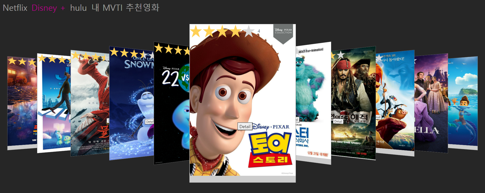

### 2) 전체 장르 인기영화, 장르별 인기 영화 정보 제공

##### (1) UI 설계 의도

- 위의 OTT 서비스 및 MVTI 추천 영화에 비해 강조하고 싶은 내용이 아니기 때문에 2D 이미지 슬라이드를 사용

##### (2) 기능 설명 및 구현 방법

- 평점을 별모양으로 보여줌

  - star-rating을 통해 평점을 별의 개수로 보여줌

    ~~~vue
    <star-rating
      v-bind:star-size="30"
      :rating="parseFloat(popular_movies[i].vote_average) / 2" 
      :read-only="true" :increment="0.01"/
    >
    ~~~

- 각 영화의 Detail 버튼을 클릭하면 각 영화의 상세페이지로 이동

  - 각 이미지 카드내의 Detail 버튼에 클릭 이벤트를 달아서 이동

    ~~~vue
    <template>
      <carousel-3d 
        :autoplay="true"
        :autoplay-timeout="3000" 
        :display="11" 
        :width="400" 
        :height="600" 
      >
        <slide v-for="(slide, i) in slides" :key="i" :index="i">
          

            
            <star-rating 
              style="position: absolute; top: 0px; text-align: center; size: 50%;}" 
              :rating="parseFloat(popular_movies[i].vote_average) / 2" 
              :read-only="true" 
              :increment="0.01"
            />
            <button class="imggroup-button1" @click="goToMovieDetail(selected_movies[i])">Detail</button>
          

        </slide>
      </carousel-3d>
    </template>
    
    
    ~~~

    

# 3. 상세페이지

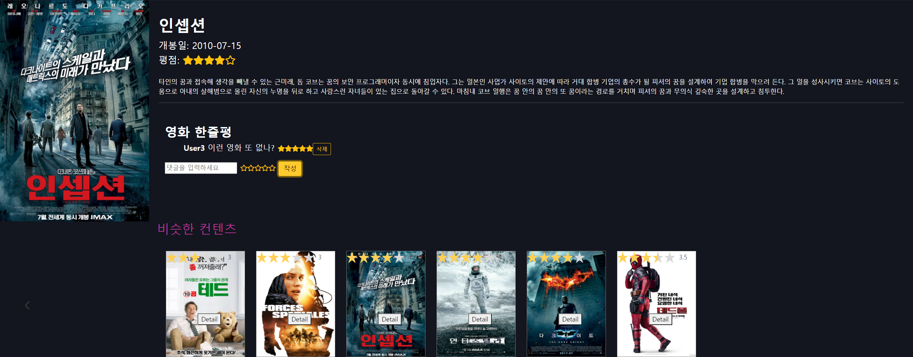

### 1) UI 설계 의도

- 영화 상세 페이지에서 해당 영화에 대한 정보뿐만 아니라 영화 리뷰, 비슷한 컨텐츠를 제공하고자 함
  - 해당 영화에 대한 직접적인 정보(영화 정보, 영화 리뷰)를 위쪽에 모아서 배치
  - 비슷한 컨텐츠 추천을 아래쪽에 배치

### 2) 기능 설명 및 구현 방법

##### (1) 영화 정보 제공 및 영화리뷰

- d-flex 클래스를 통해서 포스터를 왼쪽에 배치하고 영화 정보와 리뷰를 오른쪽에 배치
- 영화 리뷰
  - 리뷰 작성
    - v-model을 통해서 사용자가 입력하는 리뷰 데이터 양방향 바인딩
    - 각각의 별에 대해서 클릭 이벤트(@click) 를 달아서 평점을 입력받고 v-if="score < (2, 4, 6, 8, 10)"를 통해서 별을 채움
  - 리뷰 보여주기
    - v-for를 사용하여 movie.review_set안에 있는 리뷰들을 불러옴
    - 리뷰도 영화 데이터 안에 들어있기 때문에 리뷰 작성을 했을 때 영화 데이터를 새로 불러옴
  - 리뷰 삭제
    - JWT 토큰 정보를 함께 넘겨줘서 리뷰를 작성한 사용자만 해당 리뷰를 삭제할 수 있도록 함

##### (2) 비슷한 콘텐츠 추천

- TMDB에서 Get Similar movies라는 API를 제공

- 하지만, 항상 같은 개수의 영화를 보내주는 것이 아님 

  ==> 보내주는 콘텐츠의 수가 너무 적은 경우, UI의 일관성을 해침

- TMDB에서 제공해주는 비슷한 콘텐츠 이외에 추가적으로 비슷한 콘텐츠를 자체적으로 만들어서 제공(모든 영화에 대해서 15개의 영화를 추천)
  - 해당 영화의 장르들을 모두 불러오고 불러온 장르의 영화중 평점이 높은 순서대로 영화를 필요한만큼 더 가져옴 

~~~python
@api_view(['GET'])
def movie_detail(request, movie_pk) :
    # 상세페이지에서 보고 있는 영화
    movie = Movie.objects.get(pk=movie_pk)
    movie_list = [movie]
    serializer = MovieDetailSerializer(data = movie_list, many=True)

    # TMDB에서 제공하는 비슷한 콘텐츠
    movies = []
    url = f'https://api.themoviedb.org/3/movie/{movie.idx}/similar?api_key=1b7edbdee7b82ec37e80ba4d2b36db68&language=ko-KR&page=1'
    res = requests.get(url)
    similars = res.json().get('results')
    for similar in similars:
        temp_movie = Movie.objects.filter(title = similar['title'], released_date = similar['release_date']).first()
        if temp_movie != None:
            movies.append(temp_movie)

    # TMDB에서 제공하는 콘텐츠의 수
    movies_length = len(movies)
    add_count = 15 - movies_length
    # 15개 이상인 경우
    if add_count <= 0:
        movies = Movie.objects.order_by('-vote_cnt').distinct()[:15]
    # 15개 미만인 경우
    else:
        movie_genre = movie.movie_genre.all()
        movies_same_genre = Movie.objects.filter(movie_genre__id__in=movie_genre).order_by('-vote_cnt').distinct()[:add_count]
        movies += movies_same_genre
    similar_movies_serializer = MovieDetailSerializer(data = movies, many=True)

    print(serializer.is_valid(), similar_movies_serializer.is_valid())
    context = {
        "movie" : serializer.data, 
        "similar_movies" : similar_movies_serializer.data,
    }

    return Response(context)
~~~

## 4. 이상형 월드컵

### 1) 기능 설계 의도

- 영화 이상형 월드컵의 우승 영화는 사용자의 영화 취향을 분석하는데 사용된다.
- 이상형 월드컵을 진행하면서 자연스럽게 다양한 영화에 대한 정보를 얻게 된다. (간접적인 추천)
- 이상형 월드컵이 랜덤하게 만들어지기 때문에 사용자가 재밌게 봤지만, 기억하고 있지 않았던 영화에 대한 정보를 얻을 수 있음
- 사용자가 기능을 이용하는 과정에서 즐거움을 줄 수 있음

### 2) 기능 설명 및 구현 방법

1. 이상형 월드컵의 시작을 위한 영화 데이터 가져오기	
   - 인기 200개 중에서 랜덤하게 16개의 영화를 가져옴

2. 이상형 월드컵 진행

   - movies 배열에서 shift 연산을 통해서 왼쪽, 오른쪽 영화를 순서대로 가져옴
   - 왼쪽 or 오른쪽 선택시, 선택 영화를 movies 배열에 push 연산을 통해 넣음
     - 만약, movies의 길이가 1보다 작거나 같으면 우승 영화를 post요청으로 넣음

3. 이상형 월드컵 완료

   - TournamentSerializer를 통해 사용자의 이상형 월드컵 우승영화를 저장
   - 우승 영화 상세 페이지로 이동

4. 비로그인 사용자가 이상형 월드컵 페이지를 접근할 때 로그인 페이지로 이동

   - created 훅에서 NextPage를 저장하고 로그인페이지로 보냄

     ~~~javascript
     created : function(){
       if (!this.token){
         const res = {
           name : 'Tournament'
         }
         this.setNextPage(res)
         this.$router.push({name : 'Login'})
       } 
       this.getMovies()
     }
     ~~~

### 3) 작동 화면

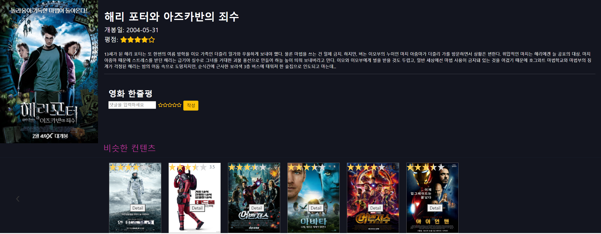

## 5. OTT 모집 게시글

### 1) 기능 설계 의도

- 요즘 사람들이 영화를 영화관에서 잘 안보고 OTT 서비스들을 통해서 많이 보고 다양한 OTT 서비스들이 등장

- 요즘 사용자들에게 도움이 될 수 있는 기능을 만들고 싶었음

- OTT 계정이 동시 접속이 가능하기 때문에 하나의 계정을 여러 명이 공유해서 사용하기도 함

  - 현재 계정 공유 방식: 게시판에서 공유자에게 연락을 하고 카카오톡으로 자세한 대화 주고 받고 계좌이체로 돈을 보내줌

    (실제 대화)

    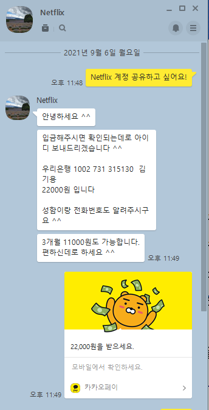

  - 계정 관리자가 돈을 받고 이용권을 공유하지 않을 수 있는 문제

  - 계정 관리자와 계정 이용자가 서로 개인정보(카카오톡 계정)를 알려줘야 하는 문제

    ==> OTT 서비스 계정 공유 게시판을 통해 거래를 중개해주는 기능

### 2) 기능 설명 및 구현 방법

##### (1) 게시글 작성

- 제목, OTT 서비스명, 총 공유 인원, 현재 공유 인원, 공유할 계정 아이디, 공유할 계정 비밀번호, 내용을 입력받아 게시글 작성

  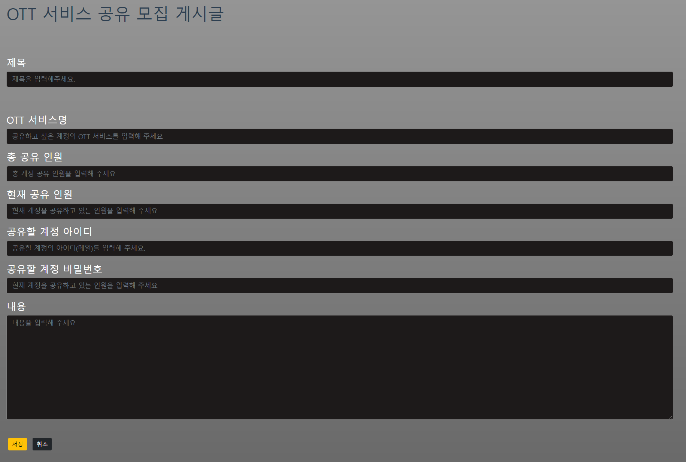

##### (2) 작성된 게시글 모아서 보기

- 지금까지 작성된 게시글들을 모아서 보여줌

- 로그인되지 않은 사용자는 로그인 페이지로 보내줌

  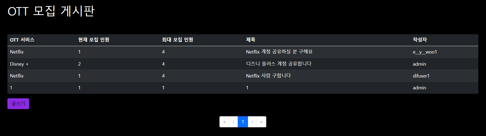

##### (3) 게시글 상세 페이지

- 게시글을 작성한 사용자는 게시글을 삭제할 수 있음
- 

